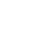
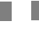
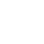
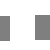
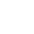
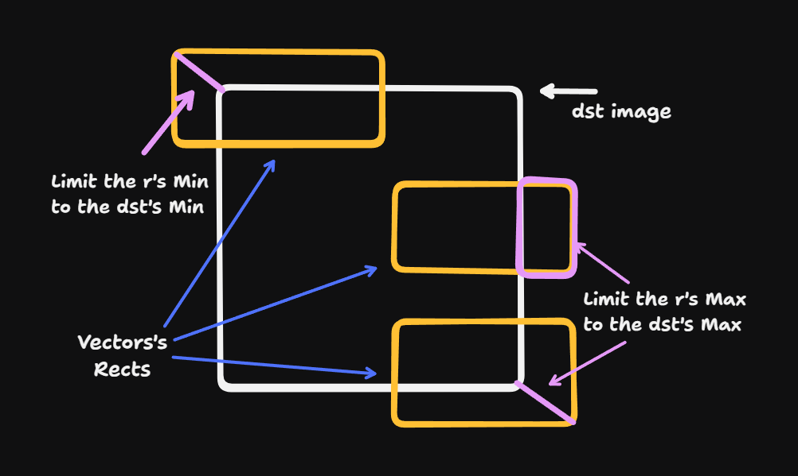

# Experiment the x/image/vector's invalid memory accesses.

Research about unexpected panics and invalid drawings of the `x/image/vector`'s `Draw` method.

## Table of content

- [Test Cases](#test-cases)
  1. [Common](#1-common)
  2. [Negative](#2-negative)
  3. [NegativeY](#3-negativey)
  4. [NegativeX](#4-negativex)
  5. [Overflow](#5-overflow)
  6. [OverflowY](#6-overflowy)
  7. [OverflowX](#7-overflowx)
- [When these happens](#when-these-happens)
- [Why these happens](#why-these-happens)
- [A Way to fix](#a-way-to-fix)

## Test cases:

### 1. Common:

Nothing special, just drawing a 25x25px vector at the 0x0 position of a 50x50px image.

| Image Type | Normal                                           | RGBA Patched                                      |
| ---------- | ------------------------------------------------ | ------------------------------------------------- |
| NRGBA      |  |  |
| RGBA       |    |    |
| Alpha      |  |  |

### 2. Negative:

Drawing a 25x25px vector at a lower position (e.g., -10x-10) of a 50x50px image's bounds.

| Image Type | Normal                                             | RGBA Patched                                        |
| ---------- | -------------------------------------------------- | --------------------------------------------------- |
| NRGBA      |  |  |
| RGBA       | PANIC                                              |    |
| Alpha      | PANIC                                              | Not Patched                                         |

### 3. NegativeY:

Drawing a 25x25px vector at a lower Y position (e.g., 0x-10) of a 50x50px image's bounds.

| Image Type | Normal                                              | RGBA Patched                                         |
| ---------- | --------------------------------------------------- | ---------------------------------------------------- |
| NRGBA      |  |  |
| RGBA       | PANIC                                               |    |
| Alpha      | PANIC                                               | NOT Patched                                          |

### 4. NegativeX:

Drawing a 25x25px vector at a lower X position with a higher Y (e.g., -10x2, to avoid crashes) of a 50x50px image's bounds.

| Image Type | Normal                                              | RGBA Patched                                         |
| ---------- | --------------------------------------------------- | ---------------------------------------------------- |
| NRGBA      |  |  |
| RGBA       |    |    |
| Alpha      |  |  |

### 5. Overflow:

Drawing a 25x25px vector at a higher position (eg: 35x35) than a 50x50px image's bounds.

| Image Type | Normal                                             | RGBA Patched                                        |
| ---------- | -------------------------------------------------- | --------------------------------------------------- |
| NRGBA      |  |  |
| RGBA       | PANIC                                              |    |
| Alpha      | PANIC                                              | Not Patched                                         |

### 6. OverflowY:

Drawing a 25x25px vector at a higher Y position (eg: 0x30) than a 50x50px image's bounds.

| Image Type | Normal                                              | RGBA Patched                                         |
| ---------- | --------------------------------------------------- | ---------------------------------------------------- |
| NRGBA      |  |  |
| RGBA       | PANIC                                               |    |
| Alpha      | PANIC                                               | Not Patched                                          |

### 7. OverflowX:

Drawing a 25x25px vector at a higher X position (eg: 35x15) than a 50x50px image's bounds.

| Image Type | Normal                                              | RGBA Patched                                         |
| ---------- | --------------------------------------------------- | ---------------------------------------------------- |
| NRGBA      |  |  |
| RGBA       |    |    |
| Alpha      |  |  |

## When these happens?

These issues will only happen if your src image is an `image.Uniform` and your dst image is one of `image.RGBA` or `image.RGBA`.

They will still draw normally if your `r`'s (second Draw method's parameter) `Min` and `Max` are within the `dst`'s range. But things start to happen if `r` isn't in the `dst`'s range, as you can see in the [test cases](#test-cases).

## Why these happens?

Both `image.RGBA` as `image.Alpha` have their own specific implementations for `image.Uniform` images as source. You can find them [here](https://cs.opensource.google/go/x/image/+/master:vector/vector.go;l=272;drc=cff245a6509b8c4de022d0d5b9037c503c5989d6).

I've done all of my researches over `image.RGBA`, so here's a detailed description. (The same goes for `image.Alpha` too)

When we call the `Draw` method with an `image.RGBA` as dst and an `image.Uniform` as src, if we assume your `DrawOp` is `draw.Over`, it will draw the vector using `rasterizeDstRGBASrcUniformOpOver` method. (which is usually `rasterizeOpOver` for other image types.) And this method does not depend on what `image.RGBA` actually provides; it will access and write the pixels manually by itself. Here's its code at the time of writing this:

```go
func (z *Rasterizer) rasterizeDstRGBASrcUniformOpOver(dst *image.RGBA, r image.Rectangle, sr, sg, sb, sa uint32) {
	z.accumulateMask()
	pix := dst.Pix[dst.PixOffset(r.Min.X, r.Min.Y):]
	for y, y1 := 0, r.Max.Y-r.Min.Y; y < y1; y++ {
		for x, x1 := 0, r.Max.X-r.Min.X; x < x1; x++ {
			ma := z.bufU32[y*z.size.X+x]

			// This formula is like rasterizeOpOver's, simplified for the
			// concrete dst type and uniform src assumption.
			a := 0xffff - (sa * ma / 0xffff)
			i := y*dst.Stride + 4*x
			pix[i+0] = uint8(((uint32(pix[i+0])*0x101*a + sr*ma) / 0xffff) >> 8)
			pix[i+1] = uint8(((uint32(pix[i+1])*0x101*a + sg*ma) / 0xffff) >> 8)
			pix[i+2] = uint8(((uint32(pix[i+2])*0x101*a + sb*ma) / 0xffff) >> 8)
			pix[i+3] = uint8(((uint32(pix[i+3])*0x101*a + sa*ma) / 0xffff) >> 8)
		}
	}
}
```

A few issues could happen with this in different cases.

1. When you pass a smaller `r.Min` than `dst.Min`.

   At this moment, it tries to access `dst.Pix` items with a negative number gathered from `dst.PixOffset`, and as you already know, you can't access an array with a negative index.

   Test cases: [Negative](#2-negative), [NegativeY](#3-negativey)

2. When you pass smaller `r.Min.X` or bigger `r.Min.X` than `dst.Rect`.

   As you can see, it just loops through the `r`'s bounds and writes the right color directly on the `dst` image without taking care of the `dst`'s limits. This causes two things: possible crashes (r.Min:(negative X, zero Y) or r.Max:(higher X, highest possible Y)), or drawing the overflowed parts of the vector on the other side of the image a single pixel higher or lower (depending on your rect's Min and Max.).

   Test cases: [NegativeX](#4-negativex), [OverflowX](#7-overflowx)

3. When you pass a higher `r.Max` than `dst.Rect.Max`.

   Same as the first case, but happens when we're drawing the pixels. It happens when there's an overflow of the vector, and it _should be_ skipped. But as it doesn't take care of the `dst.Rect`, it will try to access or write an item out of `dst.Pix`'s range. (the last 4 lines of the code above.)

   Test cases: [Overflow](#5-overflow), [OverflowY](#6-overflowy)

## A Way to fix



There are three cases that cause different issues, but they all could be fixed with a theoretically easy fix without losing that much of the performance we've had. Which is:

**Limiting the `r`'s bounds to the `dst`'s bounds!**

Here's a temporarily patch I wrote:

```go
func (z *Rasterizer) rasterizeDstRGBASrcUniformOpOver(dst *image.RGBA, r image.Rectangle, sr, sg, sb, sa uint32) {
	z.accumulateMask()

	// NEW: Calculate the offsets between dst's Min and r's Min; The goal is to
	// start drawing from the dst's Min.
	var xOffset, yOffset, pixOffset int
	if r.Min.X < dst.Rect.Min.X {
		xOffset = dst.Rect.Min.X - r.Min.X
	}
	if r.Min.Y < dst.Rect.Min.Y {
		yOffset = dst.Rect.Min.Y - r.Min.Y
	}

	// NEW: Calculate the maximum X and Y. Basically, limit the r's Max to the dst's Max.
	xMax, yMax := r.Max.X, r.Max.Y
	if xMax > dst.Rect.Max.X {
		xMax = dst.Rect.Max.X
	}
	if yMax > dst.Rect.Max.Y {
		yMax = dst.Rect.Max.Y
	}

	// CHANGED: Removed dst.Pix[...] and just kept this. You'll find more details down bellow.
	pixOffset = dst.PixOffset(r.Min.X, r.Min.Y)

	// CHANGED: Start x and y from the calculated offset.
	// CHANGED: Using yMax and xMax instead of r.Min.X and r.Min.Y for y1 and x1.
	for y, y1 := yOffset, yMax-r.Min.Y; y < y1; y++ {
		for x, x1 := xOffset, xMax-r.Min.X; x < x1; x++ {
			ma := z.bufU32[y*z.size.X+x]

			// This formula is like rasterizeOpOver's, simplified for the
			// concrete dst type and uniform src assumption.
			a := 0xffff - (sa * ma / 0xffff)
			i := pixOffset + y*dst.Stride + 4*x // CHANGED: added pixOffset

			// CHANGED: We can't pre-calculate the pix as it could be negative
			// ore more than the dst's pixels. So I just used it directly here.
			dst.Pix[i+0] = uint8(((uint32(dst.Pix[i+0])*0x101*a + sr*ma) / 0xffff) >> 8)
			dst.Pix[i+1] = uint8(((uint32(dst.Pix[i+1])*0x101*a + sg*ma) / 0xffff) >> 8)
			dst.Pix[i+2] = uint8(((uint32(dst.Pix[i+2])*0x101*a + sb*ma) / 0xffff) >> 8)
			dst.Pix[i+3] = uint8(((uint32(dst.Pix[i+3])*0x101*a + sa*ma) / 0xffff) >> 8)
		}
	}
}
```

Note 1: Of course, it's not something that you would like to see in the standard library's code, but see it as one of many ways of fixing the issue.

Note 2: This code only fixes `image.RGBA` when `DrawOP` is `draw.Over`. I've done ZERO research on `image.Alpha` and `draw.Src`.

## Thanks!

Thanks for giving your time and reading my research on this issue. I hope you've found it useful.

Also, a credit to @Monirzadeh for noticing it first at https://github.com/haashemi/writer/issues/9.
